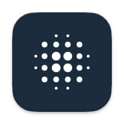
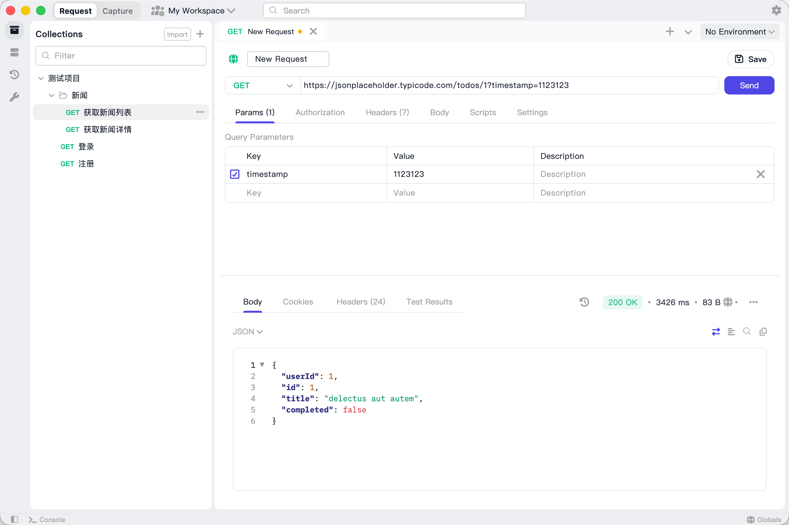
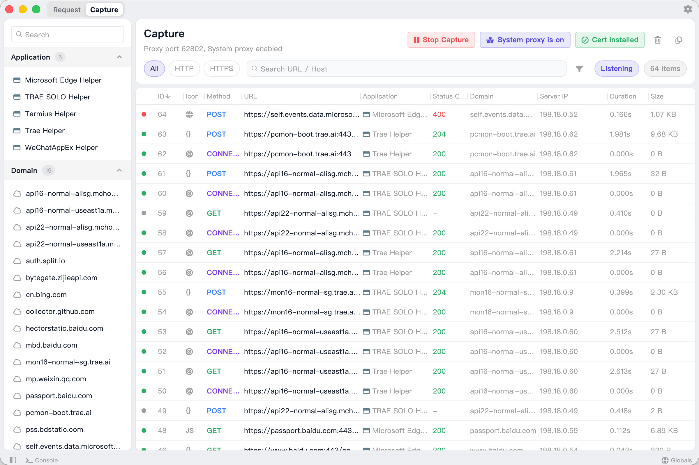
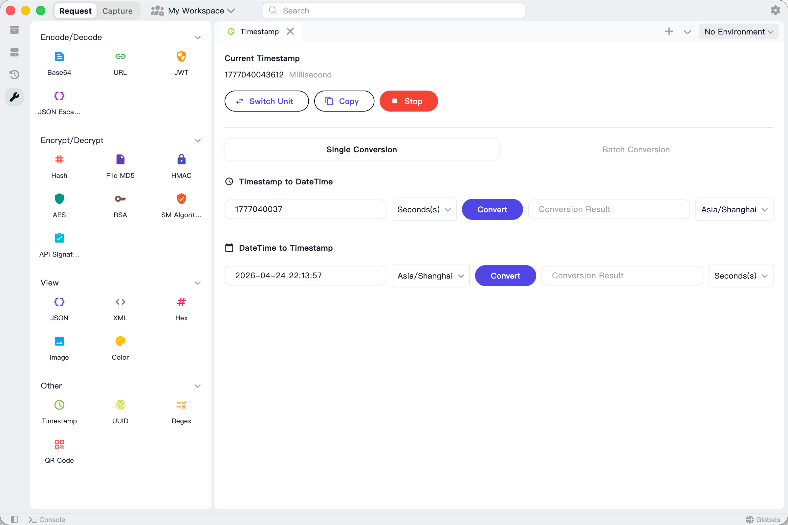
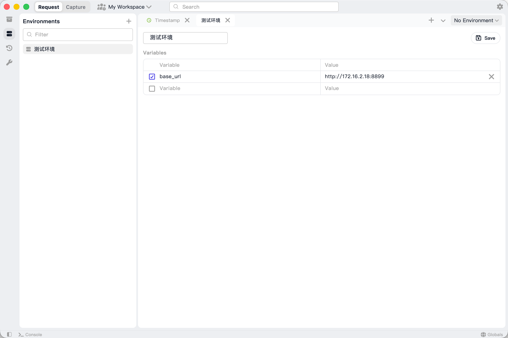

<div align="center">
  
  <h1>PostLens</h1>
  <p><b>A modern, powerful, cross-platform API debugging client built with Flutter.</b></p>
</div>

<p align="center">
  <a href="README.md">English</a> · 
  <a href="README_CN.md">简体中文</a> · 
  <a href="#-features">Features</a> · 
  <a href="#-screenshots">Screenshots</a> · 
  <a href="#-platform-support">Platform Support</a> · 
  <a href="#-getting-started">Getting Started</a> · 
  <a href="#-acknowledgments">Acknowledgments</a> · 
  <a href="#-contributing">Contributing</a>
</p>

PostLens is a high-performance, cross-platform API client designed as a modern alternative to Postman, Insomnia, and Hoppscotch. Built natively with Flutter, it delivers a lightweight and fluid experience across macOS, Windows, Linux, and more. 

Whether you are debugging REST APIs, testing WebSockets, capturing HTTP/HTTPS traffic, or running scripts, PostLens provides all the essential developer tools in one clean, unified workspace.

## 🔥 Features

- **Multi-Protocol Support** — Seamlessly test HTTP/REST, WebSocket, Socket.IO, MQTT, gRPC, TCP, and UDP endpoints from a single interface.
- **Traffic Capture & Proxy** — Built-in HTTP/HTTPS MITM proxy server to capture, inspect, and analyze network traffic on the fly.
- **Pre/Post-request Scripts** — Utilize a built-in JavaScript engine to run custom scripts before sending requests or after receiving responses.
- **High-Performance Editor** — Enjoy a smooth, syntax-highlighted coding experience with large JSON/Text responses, powered by a customized editor engine.
- **Workspaces & Collections** — Keep your projects organized with isolated workspaces, folder-based collections, and intuitive drag-and-drop support.
- **Environment Variables** — Manage configurations for multiple environments (e.g., Local, Staging, Production) and switch contexts with a single click.
- **Built-in Developer Tools** — A dedicated toolkit pane including Encoders/Decoders (Base64, URL, etc.), Encryption/Decryption (AES, RSA, SM2/SM4), Hash Generators, JWT decoding, and more.
- **Local First & Secure** — All your data (requests, environments, and certificates) is securely stored locally using `sqflite`, ensuring maximum privacy.

## 📸 Screenshots

| API Request | Traffic Capture |
|---|---|
|  |  |

| Developer Tools | Environment Settings |
|---|---|
|  |  |

## 💻 Platform Support

| Platform | Architecture | Status |
|---|---|---|
| **macOS** | aarch64, x86_64 | ✅ Supported |
| **Windows** | x86_64 | ✅ Supported |
| **Linux** | x86_64 | ✅ Supported |

## 🚀 Getting Started

### Prerequisites

- [Flutter SDK](https://flutter.dev/docs/get-started/install) (`>= 3.0.0`)
- [Rust](https://rustup.rs/) (Required for native backend integrations via `flutter_rust_bridge`)
- Platform-specific build tools (Xcode for macOS/iOS, Visual Studio for Windows, etc.)

### Build & Run

```bash
# Clone the repository
git clone https://github.com/your-username/post_lens.git
cd post_lens

# Install dependencies
flutter pub get

# Run on your current desktop platform
flutter run -d macos   # Use 'windows' or 'linux' respectively
```

### Build & Package

To build a release version for your target platform:

```bash
# Build for macOS
flutter build macos --release

# Build for Windows
flutter build windows --release

# Build for Linux
flutter build linux --release
```

Note: You must build the application on the respective operating system (e.g., build Windows on a Windows machine, macOS on a Mac).

## 🏗️ Architecture & Tech Stack

PostLens is built strictly following **Clean Architecture** principles to ensure scalability and maintainability.

| Category | Technologies |
|---|---|
| **UI Framework** | [Flutter](https://flutter.dev/) |
| **State Management**| [Riverpod](https://riverpod.dev/) |
| **Network & Protocols**| `dio`, `web_socket_channel`, `socket_io_client`, `mqtt_client`, `grpc` |
| **Local Storage** | `sqflite`, `shared_preferences` |
| **Security & Crypto** | `pointycastle`, `encrypt`, `crypto`, `dart_sm` |
| **Native Integration**| `flutter_rust_bridge`, Rust |
| **Scripting**| `flutter_js` |

**Directory Structure:**
- `lib/core/` — Core configurations, themes, intents, and constants.
- `lib/domain/` — Domain models (CaptureSession, Environment, Request, etc.) and JS engine service.
- `lib/data/` — Data layer, including local storage, network clients, and system proxy services.
- `lib/presentation/` — UI layer with Riverpod providers, specialized panes, and reusable widgets.
- `lib/re_editor/` & `lib/re_highlight/` — High-performance code editor and syntax highlighting engine.
- `src/rust/` — Native Rust backend for high-performance proxy operations.

## 🙏 Acknowledgments

This project is built upon and inspired by several amazing open-source projects. Special thanks to the **Reqable** team for their incredible text editor and syntax highlighting engines:

- [reqable/re-editor](https://github.com/reqable/re-editor) - A powerful, high-performance code editor for Flutter.
- [reqable/re-highlight](https://github.com/reqable/re-highlight) - Syntax highlighting engine for Flutter.

## 🤝 Contributing

Contributions are highly welcome! Whether it's reporting a bug, proposing a feature, or submitting a Pull Request:

1. Fork the repository
2. Create your feature branch (`git checkout -b feature/amazing-feature`)
3. Commit your changes (`git commit -m 'feat: add amazing feature'`)
4. Push to the branch (`git push origin feature/amazing-feature`)
5. Open a Pull Request

Please refer to the [SPECIFICATIONS.md](./SPECIFICATIONS.md) for UI/UX guidelines and feature planning before making major UI changes.

## 📄 License

This project is licensed under the MIT License - see the LICENSE file for details.

---

**PostLens** — The API client built for developers, by developers.
