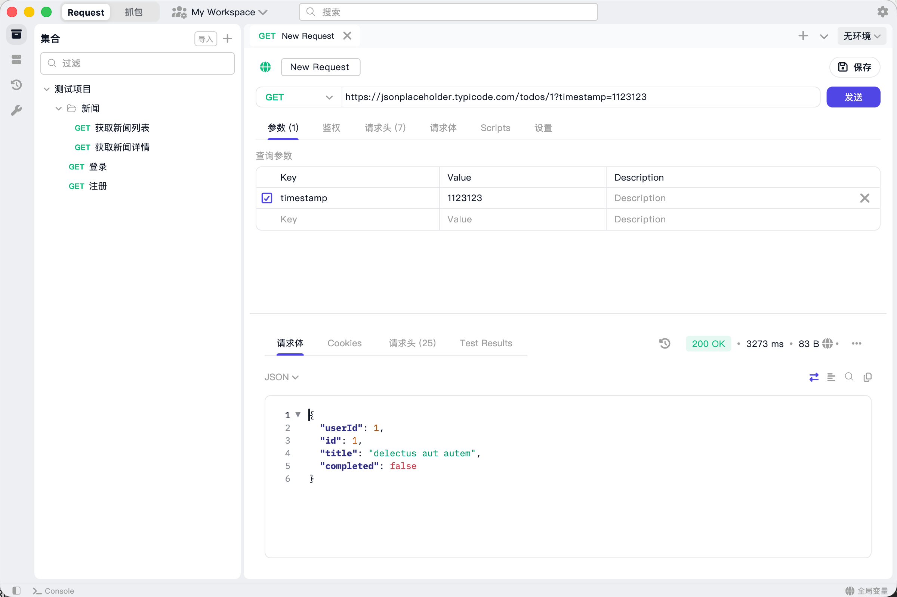
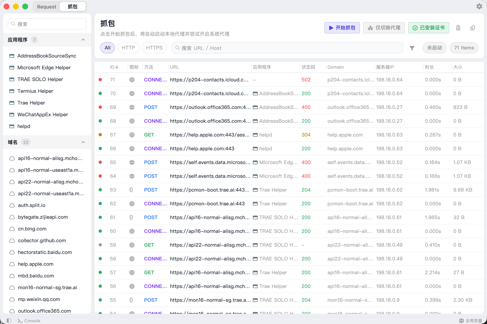
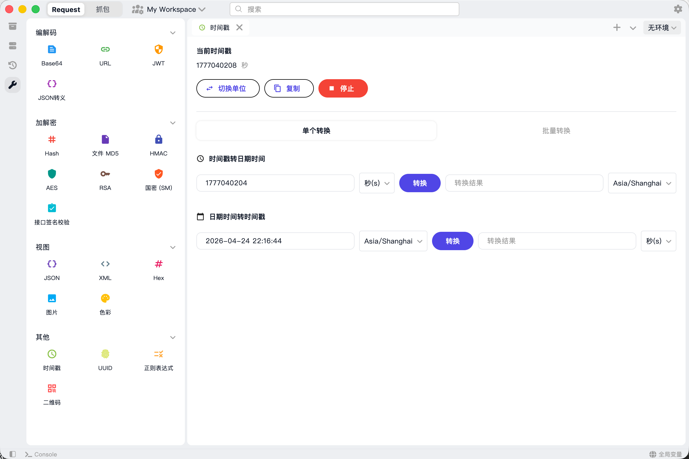
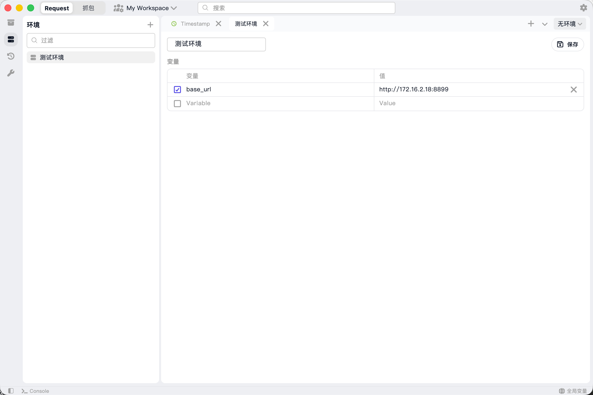

<div align="center">
  
  <h1>PostLens</h1>
  <p><b>一个基于 Flutter 构建的现代化、跨平台 API 调试客户端。</b></p>
</div>

<p align="center">
  <a href="README.md">English</a> · 
  <a href="README_CN.md">简体中文</a> · 
  <a href="#-功能特性">功能特性</a> · 
  <a href="#-应用截图">应用截图</a> · 
  <a href="#-平台支持">平台支持</a> · 
  <a href="#-快速开始">快速开始</a> · 
  <a href="#-致谢">致谢</a> · 
  <a href="#-参与贡献">参与贡献</a>
</p>

PostLens 是一个高性能、跨平台的 API 客户端，旨在成为 Postman、Insomnia 和 Hoppscotch 的现代化替代方案。它完全使用 Flutter 原生构建，在 macOS、Windows 和 Linux 上为您提供轻量、流畅且原生级别的操作体验。

无论您是在调试 REST API、测试 WebSocket、抓取 HTTP/HTTPS 流量，还是执行脚本，PostLens 都能在一个整洁统一的工作区中为您提供所有必备的开发者工具。

## 🔥 功能特性

- **多协议支持** — 在单一界面中无缝测试 HTTP/REST、WebSocket、Socket.IO、MQTT、gRPC、TCP 以及 UDP 接口。
- **流量抓包与代理** — 内置 HTTP/HTTPS MITM 代理服务器，可实时捕获、检查和分析网络流量。
- **请求前后置脚本** — 内置 JavaScript 引擎，可在发送请求前或收到响应后执行自定义脚本。
- **高性能编辑器** — 搭载定制化的编辑器引擎，为大型 JSON/文本响应提供丝滑的语法高亮和代码编辑体验。
- **工作区与集合管理** — 通过隔离的工作区、基于文件夹的集合以及直观的拖拽支持，井井有条地管理您的项目。
- **环境变量** — 轻松管理多环境配置（如 Local、Staging、Production）并实现一键上下文切换。
- **内置开发者工具** — 专属的工具箱面板，包含编码/解码（Base64、URL等）、加密/解密（AES、RSA、SM2/SM4）、哈希生成、JWT 解析等工具。
- **本地优先与安全** — 您的所有数据（请求、环境配置、证书等）均使用 `sqflite` 安全地存储在本地，最大程度保障隐私安全。

## 📸 应用截图

| API 请求 | 流量抓包 |
|---|---|
|  |  |

| 开发者工具 | 环境变量设置 |
|---|---|
|  |  |

## 💻 平台支持

| 操作系统 | 架构 | 支持状态 |
|---|---|---|
| **macOS** | aarch64, x86_64 | ✅ 完美支持 |
| **Windows** | x86_64 | ✅ 完美支持 |
| **Linux** | x86_64 | ✅ 完美支持 |

## 🚀 快速开始

### 环境依赖

- [Flutter SDK](https://flutter.dev/docs/get-started/install) (`>= 3.0.0`)
- [Rust](https://rustup.rs/) (使用 `flutter_rust_bridge` 接入原生后端所需)
- 对应平台的构建工具（如 macOS 的 Xcode，Windows 的 Visual Studio 等）

### 编译与运行

```bash
# 克隆仓库
git clone https://github.com/your-username/post_lens.git
cd post_lens

# 安装依赖
flutter pub get

# 在当前桌面平台运行
flutter run -d macos   # 对应系统可替换为 'windows' 或 'linux'
```

### 打包构建

要为您的目标平台构建发布版本：

```bash
# 构建 macOS 应用程序
flutter build macos --release

# 构建 Windows 应用程序
flutter build windows --release

# 构建 Linux 应用程序
flutter build linux --release
```

注意：您必须在相应的操作系统上进行构建（例如：在 Windows 机器上构建 Windows 版本，在 Mac 上构建 macOS 版本）。

## 🏗️ 架构与技术栈

PostLens 严格遵循 **Clean Architecture (整洁架构)** 原则构建，以确保代码的高可扩展性和可维护性。

| 类别 | 技术栈 |
|---|---|
| **UI 框架** | [Flutter](https://flutter.dev/) |
| **状态管理**| [Riverpod](https://riverpod.dev/) |
| **网络与协议**| `dio`, `web_socket_channel`, `socket_io_client`, `mqtt_client`, `grpc` |
| **本地存储** | `sqflite`, `shared_preferences` |
| **安全与加密** | `pointycastle`, `encrypt`, `crypto`, `dart_sm` |
| **原生集成** | `flutter_rust_bridge`, Rust |
| **脚本引擎** | `flutter_js` |

**目录结构：**
- `lib/core/` — 核心配置、主题、Intents 行为和全局常量。
- `lib/domain/` — 领域模型（如 CaptureSession、Environment、Request 等）以及 JS 引擎服务。
- `lib/data/` — 数据层，包含本地存储实现、网络客户端以及系统代理服务。
- `lib/presentation/` — UI 表现层，包含 Riverpod Provider、各个功能面板和可复用组件。
- `lib/re_editor/` & `lib/re_highlight/` — 高性能代码编辑器与语法高亮引擎。
- `src/rust/` — 原生 Rust 后端，用于高性能代理等操作。

## 🙏 致谢

本项目的开发离不开诸多优秀的开源项目。特别感谢 **Reqable** 团队提供的出色的文本编辑器和语法高亮引擎：

- [reqable/re-editor](https://github.com/reqable/re-editor) - 强大的 Flutter 高性能代码编辑器。
- [reqable/re-highlight](https://github.com/reqable/re-highlight) - Flutter 语法高亮引擎。

## 🤝 参与贡献

我们非常欢迎您的参与和贡献！无论是报告 Bug、提出新功能，还是提交 Pull Request：

1. Fork 本仓库
2. 创建您的特性分支 (`git checkout -b feature/amazing-feature`)
3. 提交您的修改 (`git commit -m 'feat: add amazing feature'`)
4. 推送到分支 (`git push origin feature/amazing-feature`)
5. 提交 Pull Request

在进行重大的 UI 修改之前，请参阅 [SPECIFICATIONS.md](./SPECIFICATIONS.md) 以了解项目的 UI/UX 指南和功能规划。

## 📄 许可证

本项目基于 MIT 许可证开源 - 详情请参阅 LICENSE 文件。

---

**PostLens** — 开发者为开发者构建的 API 客户端。
